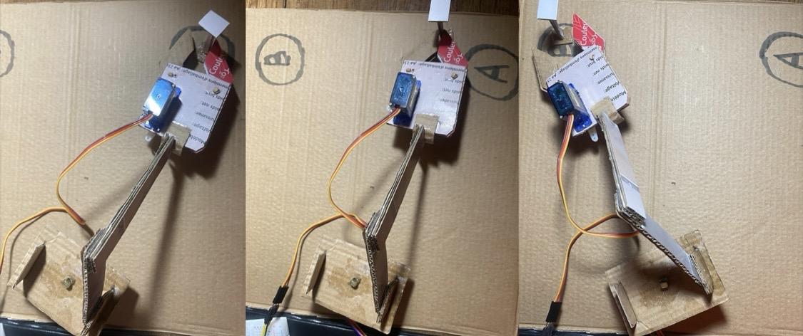
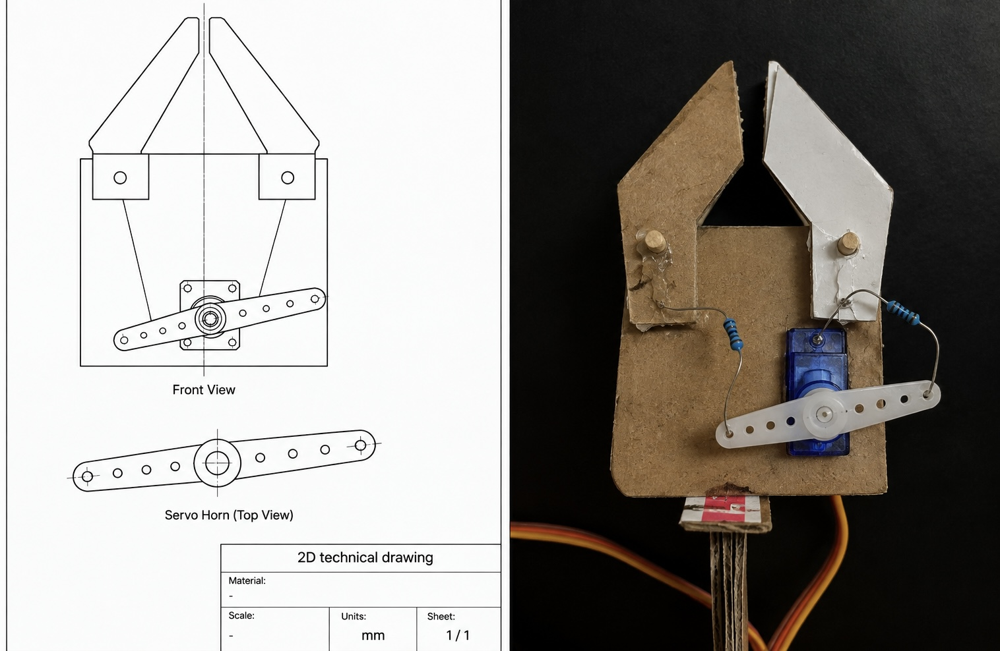
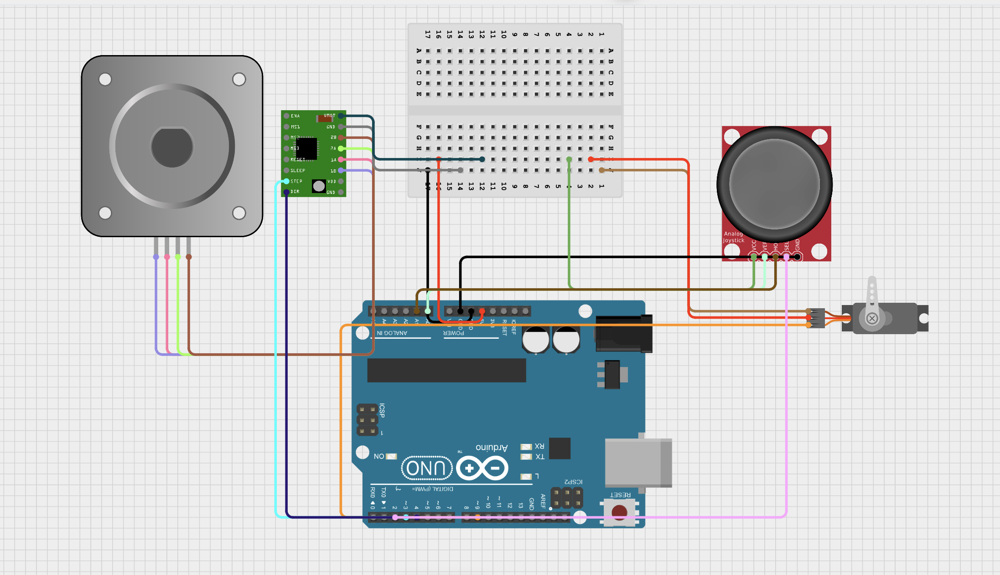

# Simple-Robotic-Arm
Simple Robotic Arm is a beginner-friendly Arduino project. Compatible with most Arduino starter kits, designed to move a small object from Point A to Point B using two motors and a joystick controller.

## Robotic arm picture


## 🦾 How it work 



the robotic arm is controlled by a joystick.

• Left / Right: moves the arm using the stepper motor.

• Up / Down: controls the servo.

• The servo opens and closes the gripper to grab or release objects.


## Components

🔋electronics parts:

Arduino Uno

28BYJ-48 / Bipolar Stepper Motor

ULN2003 Stepper / A4988 Stepper Motor Driver

SG90 Servo Motor

Analog Joystick

Breadboard

Jumper Wires

USB Cable

Resistors ( use it as wires for the grippers)

⚙️ Mechanical Parts:

lightweight cardboard or plastic material to form:

base frame for step motor

servo mounting bracket

Mechanical arm structure

Grippers

## Grippers Structure



## Real Circuit


## Wirring


## arduino code 

for 28BYJ-48 Stepper Motor and ULN2003 Stepper Motor Driver

```cpp
#include <Servo.h>
#include <Stepper.h>

// ===== STEPPER =====
const int stepsPerRevolution = 2048;

Stepper stepper(stepsPerRevolution, 2, 4, 3, 5);

// ===== SERVO =====
Servo myServo;
const int servoPin = 9;

// ===== JOYSTICK =====
const int joyX = A0;
const int joyY = A1;

int servoAngle = 90;

void setup() {
  myServo.attach(servoPin);
  myServo.write(servoAngle);

  stepper.setSpeed(10);

  Serial.begin(9600);
}

void loop() {

  int xValue = analogRead(joyX);
  int yValue = analogRead(joyY);

  // =========================
  // LEFT / RIGHT → STEPPER
  // =========================

  if (xValue < 400) {
    stepper.step(-5);
  }
  else if (xValue > 600) {
    stepper.step(5);
  }

  // =========================
  // UP / DOWN → SERVO
  // =========================

  if (yValue < 400) {
    servoAngle++;
  }
  else if (yValue > 600) {
    servoAngle--;
  }

  // Keep servo between 0 and 180 degrees
  servoAngle = constrain(servoAngle, 0, 180);

  myServo.write(servoAngle);

  delay(10)
}   
```
int yValue = analogRead(joyY);


## Circuit Simulation

for the Bipolar Stepper Motor




## Arduino Code


for Bipolar Stepper Motor and A4988 Stepper Motor Driver

```cpp
#include <Servo.h>

Servo myServo;

// Joystick
const int horzPin = A0;
const int vertPin = A1;

// A4988
const int stepPin = 3;
const int dirPin = 4;

// Servo
const int servoPin = 9;

int servoPosition = 0;

void setup() {
  pinMode(stepPin, OUTPUT);
  pinMode(dirPin, OUTPUT);

  myServo.attach(servoPin);
  myServo.write(0);

  Serial.begin(9600);
}

void loop() {

  int horz = analogRead(horzPin);
  int vert = analogRead(vertPin);

  // =========================
  // JOYSTICK X → STEPPER
  // =========================

  if (horz > 600) {
    // Joystick RIGHT
    digitalWrite(dirPin, HIGH);

    digitalWrite(stepPin, HIGH);
    delayMicroseconds(800);
    digitalWrite(stepPin, LOW);
    delayMicroseconds(800);
  }

  else if (horz < 400) {
    // Joystick LEFT
    digitalWrite(dirPin, LOW);

    digitalWrite(stepPin, HIGH);
    delayMicroseconds(800);
    digitalWrite(stepPin, LOW);
    delayMicroseconds(800);
  }

  // =========================
  // JOYSTICK Y → SERVO
  // =========================

  if (vert > 600) {
    // Joystick UP → servo 90°
    myServo.write(90);
  }

  else if (vert < 400) {
    // Joystick DOWN → servo 0°
    myServo.write(0);
  }
}


